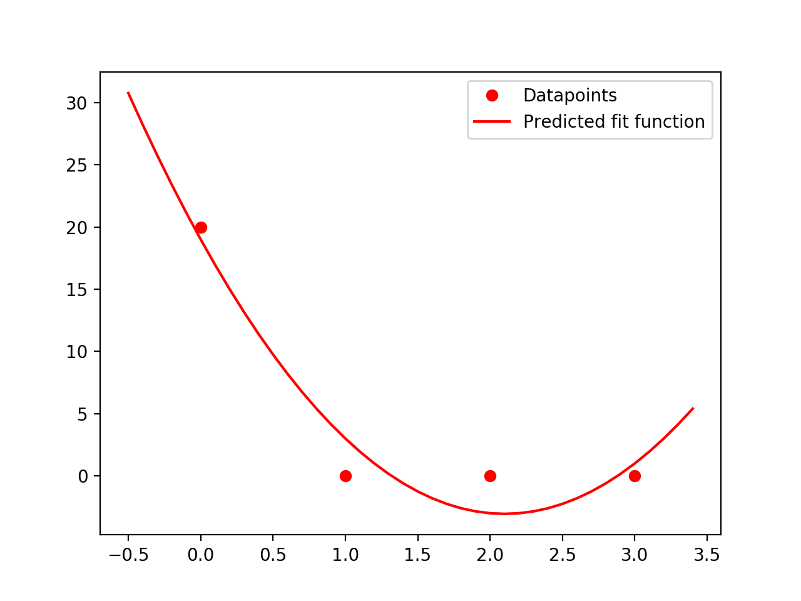

## Problem 1 (math)

#### So the input is the following:

| X | Y |
|---|---|
| 0 | 20|
| 1 | 0 |
| 2 | 0 |
| 3 | 0 |

#### Then X is a matrix:

>X = $\begin{bmatrix}0&0&1\\1&1&1\\4&2&1\\9&3&1\end{bmatrix}$

#### and y is a vector:

> y = $\begin{bmatrix}20\\0\\0\\0\end{bmatrix}$

> **$ \hat{\alpha} = (X\cdot X^T)^{-1} \cdot X^T\cdot y$**.

Then $ \hat{\alpha} = (\begin{bmatrix}0&1&4&9\\0&1&2&3\\1&1&1&1\end{bmatrix} \cdot \begin{bmatrix}0&0&1\\1&1&1\\4&2&1\\9&3&1\end{bmatrix})^{-1}\cdot \begin{bmatrix}0&1&4&9\\0&1&2&3\\1&1&1&1\end{bmatrix} \cdot \begin{bmatrix}20\\0\\0\\0\end{bmatrix} = \begin{bmatrix}98&36&14\\36&14&6\\14&6&4\end{bmatrix}^{-1}\cdot \begin{bmatrix}0&1&4&9\\0&1&2&3\\1&1&1&1\end{bmatrix} \cdot \begin{bmatrix}20\\0\\0\\0\end{bmatrix} = \begin{bmatrix}1/4&-3/4&1/4\\-3/4&49/20&-21/20\\1/4&-21/20&19/20\end{bmatrix}\cdot \begin{bmatrix}0&1&4&9\\0&1&2&3\\1&1&1&1\end{bmatrix} \cdot \begin{bmatrix}20\\0\\0\\0\end{bmatrix} = \begin{bmatrix}5\\-21\\19\end{bmatrix}$.

$ \hat{\alpha} = \begin{bmatrix}5\\-21\\19\end{bmatrix}$.

> So **$f(x) = 5x^2 -21x +19$**

This graph can also be generated by running  `python3 Problem1.py` file